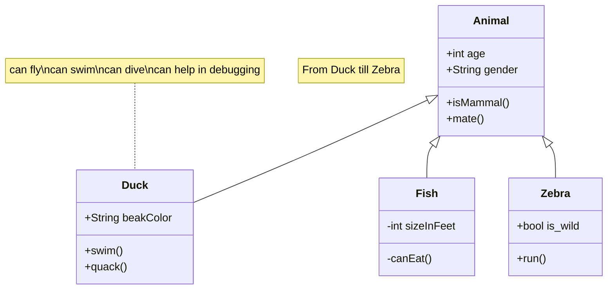

# 100-coding-questions

### 1. Find a number is positive or negative ?
<details>
<summary><b>Solution</b></summary>

Any folded content here. It requires an empty line just above it.


  ```java
class Main
{
  public static void main (String[]args)
  {

    int num = 5;

    if (num > 0)
        System.out.println ("The number is positive");
    else if (num < 0)
        System.out.println ("The number is negative");
    else
        System.out.println ("Zero");
  }
}
```
</details> 
  
  
### 2. Find a number is Even or Odd?

```java
// Using Modulus Operator
public class Main
 {
      public static void main(String[] args) {
           int number = 29;


     //checking whether the number is even or odd
     if (number % 2 == 0)
              System.out.println(number + " is Even");
     else
              System.out.println(number + " is odd");
      }
 }
```
```java
// Using Bitwise Operator
public class Main
{
  public static void main (String[]args)
  {
    int number = 29;

    if (isEven (number))
        System.out.println ("Even");
    else
        System.out.println ("Odd");
  }


// Returns true if n is even, else odd
  static bool isEven (int number)
  {

    // n & 1 is 1, then odd, else even
    return (!(number & 1));
  }
}
```


